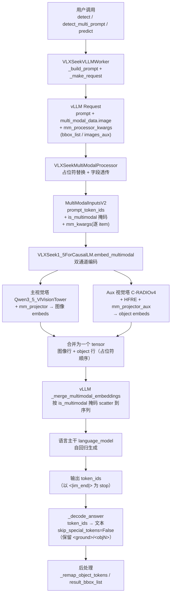
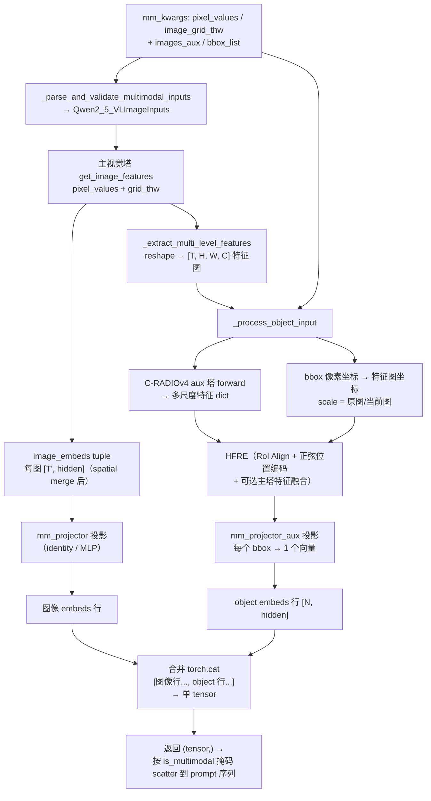
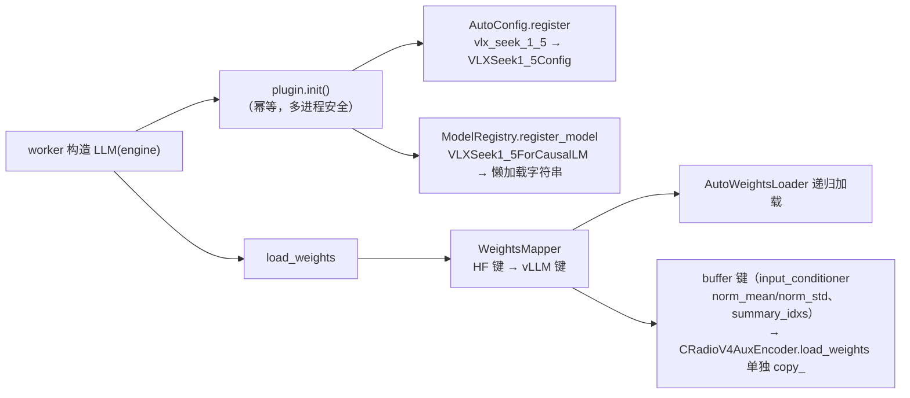

# VLX-Seek vLLM 服务：图像 + Prompt 数据流程

> 本文档梳理 `vllm_serve/` 模块中，"图像 + Prompt（含可选的 object bbox 提示）"
> 从用户输入到模型输出的完整数据流，重点标注每一步的**数据形状变化**与**占位符机制**。

---

## 1. 模块总览

| 文件 | 职责 |
| --- | --- |
| [plugin.py](./plugin.py) | vLLM 插件入口：注册 `vlx_seek_1_5` config 与模型类，幂等，覆盖所有 worker 子进程 |
| [vlx_seek_vlm.py](./vlx_seek_vlm.py) | 自定义多模态模型 `VLXSeek1_5ForCausalLM`（Qwen3.5 主干 + VLX-Seek 视觉栈）+ 自定义 `VLXSeekMultiModalProcessor` |
| [vlx_seek_vllm_worker.py](./vlx_seek_vllm_worker.py) | 推理 worker：`detect / detect_multi_prompt / predict / ground / count` 等，与 HF `VLXSeekWorker` 同接口 |
| [bench_prefix_cache.py](./bench_prefix_cache.py) | prefix caching 命中基准：同图同 objects、不同类别后缀的批量请求 |
| [vllm_vs_hf.md](./vllm_vs_hf.md) | vLLM 后端实现功能、与 HF 的区别、优缺点对比 |
| `test_*.py` | 冒烟 / 一致性 / 诊断脚本 |

核心收益（相对 HF 串行推理）：
- 引擎常驻，图像编码 + LLM 权重一次加载；
- 同 crop 的多个 prompt 批量提交，共享图像/object 前缀 KV（APC 在 scheduler 层自动复用）。

---

## 2. 整体数据流



---

## 3. 请求构建（worker 层）

### 3.1 输入

- `image`：PIL Image（原图，bbox 坐标基于原图像素）
- `question` / `task`：检测 / 计数 / grounding 等任务文本
- `bbox_list`：`[[x1, y1, x2, y2], ...]`（原图像素坐标，可选）

### 3.2 Prompt 模板（`_build_prompt`）

无 bbox 时：

```text
<|im_start|>user\n<|vision_start|><|image_pad|><|vision_end|>\n{question}<|im_end|>\n<|im_start|>assistant\n
```

有 bbox 时（`<objfeat>` 每框一个，`<objN>` 是模型输出时引用框的索引 token）：

```text
<|im_start|>user\n<|vision_start|><|image_pad|><|vision_end|>\n<obj0><objfeat><obj1><objfeat>\n{question}<|im_end|>\n<|im_start|>assistant\n
```

### 3.3 请求 dict（`_make_request`）

```python
request = {
    "prompt": prompt,                          # 模板 prompt
    "multi_modal_data": {"image": image},      # 主图像（主视觉塔输入）
    "mm_processor_kwargs": {
        "bbox_list":  torch.tensor([boxes]),   # [1, N, 4] 原图像素坐标
        "images_aux":  aux["pixel_values"],    # [1, C, H, W]（C-RADIOv4 aux 塔输入）
    },
}
```

其中 `images_aux` 由 `CLIPImageProcessor` 生成（C-RADIOv4 硬编码配置，与 HF worker 一致）：

```python
aux_processor = CLIPImageProcessor(
    do_resize=False, do_center_crop=False, do_rescale=True,
    do_normalize=False, do_convert_rgb=True, resample=3,
)
```

> 注意：主视觉塔（Qwen3.5-VL）的预处理（patchify / 归一化 / grid 切分）在 processor 层完成；
> aux 塔（C-RADIOv4）的预处理（仅 rescale、不归一化）在 worker 层预先完成。
> 二者使用**不同**的预处理策略，因此存在两条独立图像通道。

### 3.4 排序与映射

`_order_boxes` 依据 config 的 `mm_bbox_order_mode`（`raster` / `area_asc` / `area_desc` / `none`）对候选框排序，
并记录 `sorted_to_original` 映射；prompt 中的 `<objN>` 与输出中的 `<objN>` 都经
`VLXSeekWorker._remap_prompt_object_tokens` / `_remap_object_tokens` 映射回调用方原始索引。

---

## 4. MultiModalProcessor：占位符替换与字段透传

`VLXSeekMultiModalProcessor` 继承 `Qwen3VLMultiModalProcessor`，三个关键覆写：

### 4.1 `_get_prompt_updates` — 占位符处理

| 占位符 | token id | 行为 |
| --- | --- | --- |
| `<|image_pad|>` | 248056 | 展开为 **图像实际 token 数** 个 pad token（数量 = `grid_thw.prod() // merge²`） |
| `<|vision_end|>` | — | 保留在序列末尾（vision 段闭合符） |
| `\n` + `<objN>` | 各单 token | 逐框 `<objN>` 后紧跟一个 `<objfeat>` |
| `<objfeat>` | 248181 | 单 token，经 `is_embed` 掩码标记 → 进入 is_multimodal 掩码 |

**实现要点（vLLM 0.17 行为约束）**：vLLM 0.17 对同一 item 的多个 prompt updates
只应用第一个（`_find_matches` 中 `"Already found a match for this item"` 直接 break），
因此**不能**在基类 image replacement 之外再追加独立的 `<objfeat>` replacement——
那样 248181 永远不进掩码，对象嵌入会在 `_merge_multimodal_embeddings` 的
`masked_scatter_` 中被静默丢弃（输出发散为 `'小汽车None'`）。

正确做法是「**单个合并 replacement**」：移除基类的 image update，把 image_pad 段 +
objfeat 行合并为一个 target，replacement 用 `PromptUpdateDetails.select_token_ids`
同时标记图像 token 与 `<objfeat>` 位置：

```python
# target（文本形式，不含 <|vision_start|>）：失败时自动回退字符串匹配
if n_boxes == 0:
    target = "<|image_pad|><|vision_end|>"
else:
    target = "<|image_pad|><|vision_end|>\n" + "".join(
        f"<obj{i}><objfeat>" for i in range(n_boxes)
    )

# replacement：展开后的 token 序列 + is_embed 掩码
full = [image_token_id] * num_tokens + [vision_end_id]
if n_boxes > 0:
    full.append(newline_id)
    for i in range(n_boxes):
        full.extend([obj_token_ids[i], _OBJFEAT_TOKEN_ID])
return PromptUpdateDetails.select_token_ids(full, [image_token_id, _OBJFEAT_TOKEN_ID])
```

`n_boxes` 从 `hf_processor_mm_kwargs["bbox_list"]` 推断（`bbox_list.shape[-2]`），
与 worker `_build_prompt` 的 `<objN>` 行严格一致；dummy/profile 输入
（`Qwen3VLDummyInputsBuilder`）无 bbox，target 退化为不含 `\n` 的纯 image_pad 段。

### 4.2 `_call_hf_processor` — 透传自定义字段

- 从 `mm_kwargs` 弹出 `bbox_list` / `images_aux`（不传给 HF processor，避免报错）；
- 调用基类让 HF Qwen3.5 processor 处理主图像 → `pixel_values` + `image_grid_thw`；
- 把 `bbox_list` / `images_aux` 合并回 `BatchFeature`。

### 4.3 `_get_mm_fields_config` — 注册 batched 字段

```python
if "images_aux" in hf_inputs:
    fields["images_aux"] = MultiModalFieldConfig.batched("image")
if "bbox_list" in hf_inputs:
    fields["bbox_list"] = MultiModalFieldConfig.batched("image")
```

`images_aux` / `bbox_list` 与 `pixel_values` 一样按 **image modality** 批量切分，
使每个 image item 的 mm_kwargs 自带对应的 aux 数据与框坐标。

---

## 5. `embed_multimodal`：图像 + Object 双通道编码

vLLM 引擎对每个 image item 调用一次 `embed_multimodal(**mm_kwargs)`，
VLX-Seek 覆写后按"图像通道 + object 通道"并行编码，最终合并为一个 tensor 返回
（sanity check 要求 mm item 数 = 返回元素数，因此 1 个 image item → 返回 1 元素 tuple）。



### 5.1 主图像通道（`_process_image_and_object`）

1. `self.visual.get_image_features(pixel_values, grid_thw)`：
   - `Qwen3_5VisionModel` 编码，输出按 `grid_thw.prod(-1) // spatial_merge_size²` 切分为每图一个 token 序列；
2. `_extract_multi_level_features`：把最终 token 序列 reshape 为 `[T, H, W, hidden]` 的空间特征图（object 通道需要）；
3. `mm_projector` 逐图投影 → 图像 embeds。

### 5.2 Object 通道（`_process_object_input` → `encode_objects`）

前置条件：`images_aux`、`bbox_list`、`vision_tower_aux`、`vt_multi_level_features` 全部齐备且存在有效 bbox。

1. **形状规整**：`images_aux` → `list of [C, H, W]`；`bbox_list` → `list of [N, 4]`；
2. `vt_images_size = grid_thw[..., -2:] * patch_size`（推断原图尺寸，用于坐标缩放）；
3. aux 塔 `CRadioV4AuxEncoder` forward → 每图返回 `{"image_features": [level_0, level_1, ...]}` 多尺度特征；
4. 坐标换算：`bbox_scale = 原图尺寸 / 当前特征图尺寸`，生成 `vt_boxes`；
5. `HybridFineGrainedRegionEncoder`（HFRE）：
   - 对 aux 多尺度特征执行 RoI Align 提取区域特征；
   - 归一化 bbox 生成正弦位置编码；
   - `mm_use_vision_tower_object_feature=True` 时融合主塔多尺度特征；
   - 池化（mean 等）→ 每个 bbox 一个特征向量 `[N, hidden]`；
6. `mm_projector_aux` 投影 → object embeds。

### 5.3 合并顺序保证

合并后的行序必须与 prompt 中占位符顺序一致：**先图像行（`<|image_pad|>` 位置），再 object 行（`<objfeat>` 位置）**，
vLLM 的 `_merge_multimodal_embeddings` 按 is_multimodal 掩码顺序 scatter，保证嵌入插入位置与占位符一一对应。

---

### 5.4 输出解码与后处理（worker 层）

生成结束后，`CompletionOutput.text` **不能直接使用**：vLLM 默认
`skip_special_tokens=True`，会把 `<ground>` / `<objN>` 等单 token 标签在
decode 时静默丢弃，只剩中间类别文本，导致 `_build_result_bbox_list` 解析为空。
因此 worker 统一走 `_decode_answer()`：

```python
def _decode_answer(self, out) -> str:
    text = self.tokenizer.decode(
        out.outputs[0].token_ids, skip_special_tokens=False
    )
    return text.replace("<|im_end|>", "").strip()
```

与 HF 端（`tokenizer.decode(ids, skip_special_tokens=False)` +
`replace("<|im_end|>", "")`）行为完全一致。之后流程与 HF 相同：

1. `_remap_object_tokens(answer, sorted_to_original)`：把输出里的 `<objN>` 映射回调用方原始框索引；
2. `_build_result_bbox_list(answer, caller_boxes)`：解析 `<ground>类别</ground><objects><objN>...</objects>`
   结构，输出 `result_bbox_list`。

> 注意：生成停止由 `SamplingParams.stop=["<|im_end|>"]` 负责（vLLM 侧），
> token_ids 中不含 `<|im_end|>`；`_decode_answer` 里的 replace 仅兜底。

---

## 6. 权重加载与模型注册



- config 注册让 transformers `AutoConfig` 认识 `vlx_seek_1_5`（`VLXSeek1_5Config` 继承 vLLM 的 `Qwen3_5Config`）；
- 权重映射 `hf_to_vllm_mapper`：`model.vision_tower.* → visual.*`、`model.language_model.* → language_model.model.*` 等，
  长前缀必须先于超集（`model.` 前）遍历；
- C-RADIOv4 的 buffer（非 nn.Parameter）由 `CRadioV4AuxEncoder.load_weights` 分离处理，否则 `AutoWeightsLoader` 报缺失参数。

---

## 7. 关键形状与常量速查

| 数据 | 形状 / 值 | 说明 |
| --- | --- | --- |
| 主图像 `pixel_values` | `[1, 3, patch_h, patch_w]` | HF Qwen3.5 processor 输出（已 patchify + 归一化） |
| `image_grid_thw` | `[1, 3]` | 切分网格 `[T, H, W]` |
| 图像 embeds | `tuple of [T', hidden]` | `T' = T*H*W / merge²` |
| aux `images_aux` | `[1, 3, H, W]` | CLIPImageProcessor 输出（仅 rescale，不归一化） |
| `bbox_list` | `[1, N, 4]` | 原图像素坐标 |
| aux 塔输出 | `{"image_features": [L, C, H, W]}` | C-RADIOv4 多尺度特征 |
| object embeds | `[N, mm_object_hidden_size]` | 每框一个向量（HFRE + mm_projector_aux） |
| `<|image_pad|>` token id | 248056 | 图像占位符 |
| `<objfeat>` token id | 248181 | 单 token，进入 is_multimodal 掩码 |

---

## 8. 参考代码位置

| 环节 | 位置 |
| --- | --- |
| 请求构建 / prompt 模板 | [vlx_seek_vllm_worker.py](./vlx_seek_vllm_worker.py) `_build_prompt` / `_make_request` |
| 占位符替换 / 字段透传 | [vlx_seek_vlm.py](./vlx_seek_vlm.py) `VLXSeekMultiModalProcessor` |
| 双通道编码 / 嵌入合并 | [vlx_seek_vlm.py](./vlx_seek_vlm.py) `embed_multimodal` / `_process_image_and_object` / `_process_object_input` |
| 输出解码 / 停止条件 | [vlx_seek_vllm_worker.py](./vlx_seek_vllm_worker.py) `_decode_answer` / `_run_generate`（`SamplingParams.stop`） |
| object 特征提取 | [hybrid_finegrained_region_encoder.py](../vlx_seek/models/vlx_seek_1_5/multimodal_visual_prompt_encoder/hybrid_finegrained_region_encoder.py) `HybridFineGrainedRegionEncoder` |
| 主视觉塔 | [qwen3_5_vl_encoder.py](../vlx_seek/models/vlx_seek_1_5/multimodal_encoder/qwen3_5_vl_encoder.py) `Qwen3_5_VlVisionTower` |
| aux 视觉塔 | [c_radio_v4_aux_encoder.py](../vlx_seek/models/vlx_seek_1_5/multimodal_encoder/c_radio_v4_aux_encoder.py) `CRadioV4AuxEncoder` |
| 插件注册 | [plugin.py](./plugin.py) `init()` |
| 一致性回归 | [test_consistency.py](./test_consistency.py) |
| 与 HF 对比 / 优缺点 | [vllm_vs_hf.md](./vllm_vs_hf.md) |
